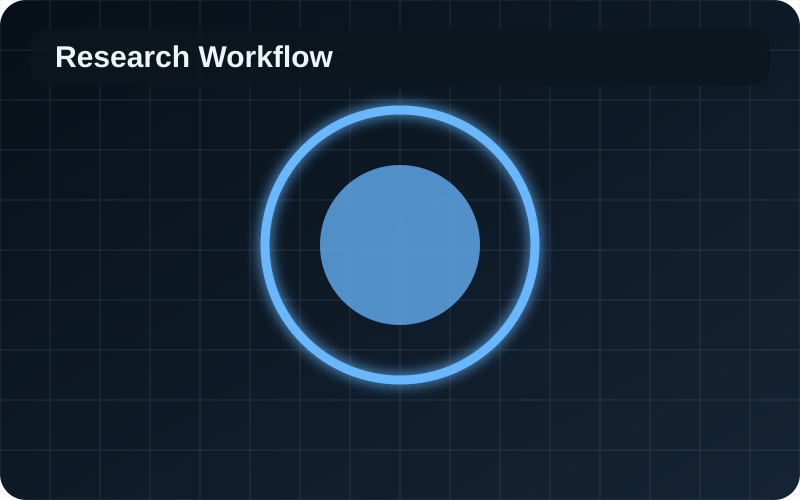

# PhD Research Constellation

Premium interactive Three.js research universe organized into **two core research themes**:

1. **Theme I — Composite Manufacturing & Multiscale Modeling**
2. **Theme II — Battery Manufacturing & Multiscale Modeling**

Live GitHub Pages site:

```text
https://wangluo021.github.io/phd-research-3d-map/
```

## Screenshot



Replace this placeholder with a deployed-site screenshot when you want the README to show the actual rendered 3D interface.

## Project overview

This is a static Three.js interactive PhD research portfolio. It presents dissertation research as a pastel pink-blue digital research universe with content stored in `js/research-data.js` and visual assets stored in `assets/images/`.

The map supports:
- 3D rotation by dragging
- zoom by mouse wheel / trackpad / pinch
- click-to-expand and click-to-collapse research branches
- image previews beside nodes
- a right-side image gallery for each selected node
- related models, experiments, publications, and next steps
- GitHub Pages deployment

The visual system uses a layered translucent research core, sculptural theme objects, topic-specific child node archetypes, pastel glass materials, soft cinematic lighting, square pixel-like data particles, glowing branch splines, high-resolution labels, high-DPI rendering, and floating image planes beside nodes.

## Visual Direction

The interface is designed as a refined academic research installation rather than a conventional dashboard or retro pixel-art page. The palette uses deep navy, charcoal blue, powder blue, pastel pink, lavender, pale cyan, and pearl white in a restrained way.

Pixel influence appears only as small square particles, subtle stepped glows, and interface accents. Text, images, and geometry remain crisp and high-resolution.

## Rendering Notes

- Three.js loads from jsDelivr over HTTPS.
- The renderer uses `THREE.SRGBColorSpace` and `THREE.ACESFilmicToneMapping`.
- Device pixel ratio is capped for clarity and performance.
- Label textures are generated at high resolution and use anisotropy.
- Image textures use `THREE.SRGBColorSpace`, mipmaps, linear filtering, and maximum supported anisotropy.
- The page includes a visible fallback message if WebGL or the CDN import fails.

## Project structure

```text
.
├── index.html
├── css/
│   └── styles.css
├── js/
│   ├── app.js
│   └── research-data.js
├── assets/
│   └── images/
│       ├── core-workflow.svg
│       ├── pultrusion.svg
│       ├── cathode-microstructure.svg
│       └── ...
├── .nojekyll
└── README.md
```

`index.html` must stay at the repository root for GitHub Pages branch deployment from `/ (root)`.

## Current research structure

```text
PhD Research
├── Theme I — Composite Manufacturing & Multiscale Modeling
│   ├── Pultrusion Process Modeling
│   │   ├── Thermo-Chemical & Cure Modeling
│   │   ├── 3D / 2D / 1D Multi-Fidelity Models
│   │   └── Pulling Force & Process Optimization
│   ├── Fiber Architecture & Structural Performance
│   ├── Polymer & Interface Molecular Modeling
│   │   ├── PU Cure + MD + GPR
│   │   ├── PP / Carbon Fiber Interface
│   │   └── PP / Cellulose Interface
│   ├── Composite Experimental Validation
│   └── Composite Publications & Industry Translation
└── Theme II — Battery Manufacturing & Multiscale Modeling
    ├── Cathode Mechanics & Calendering
    │   ├── SEM → Heterogeneous RVE
    │   ├── 2D Abaqus + 1D Reduced-Order Model
    │   └── 3D Roller Calendering
    ├── Dry Electrode & Solid-State Manufacturing
    │   ├── Dry Mixing, CNF & Binder
    │   ├── Electrostatic Spray & Deflector
    │   └── Hot Calendering & Layer Integrity
    ├── Electrochemical Performance Link
    ├── Solid Electrolyte Molecular Modeling
    ├── Battery Experimental Validation
    └── Battery Publications & Future Work
```

## Add your own images

Put images in:

```text
assets/images/
```

For example:

```text
assets/images/my-abaqus-result.png
assets/images/my-sem-image.jpg
assets/images/my-ovito-interface.png
```

Then edit `js/research-data.js`:

```js
{
  id: "pp-carbon",
  name: "PP / Carbon Fiber Interface",
  category: "composites",

  preview: "assets/images/my-ovito-interface.png",

  images: [
    {
      src: "assets/images/my-ovito-interface.png",
      caption: "LAMMPS / OVITO PP-carbon interface"
    },
    {
      src: "assets/images/adhesion-energy.png",
      caption: "Interfacial separation energy"
    }
  ],

  models: [
    "PP molecular slab",
    "Graphitic carbon surface",
    "Interaction energy",
    "Work of adhesion"
  ],

  papers: [],
  next: ["Run separation simulations"]
}
```

### Meaning of the main fields

- `name`: node label
- `description`: description shown in the side panel
- `preview`: small image next to the 3D node
- `images`: image gallery shown after clicking the node
- `models`: models / experiments associated with that node
- `papers`: papers and DOI links
- `next`: next research steps
- `children`: sub-branches

You normally only need to edit **`js/research-data.js`** and add files under **`assets/images/`**. The Three.js map code is in `js/app.js` and does not need to be changed for normal content updates.

## Run locally

This version no longer imports the local data file as an ES module, so it is more tolerant of opening the project directly.

You can first try double-clicking:

```text
index.html
```

The page still loads Three.js from the internet, so an internet connection is required.

For the most reliable local test, run a local server:

```bash
cd phd-research-3d-map
python -m http.server 8000
```

Then open:

```text
http://localhost:8000
```

If Three.js cannot load, the page now shows a readable error message instead of remaining permanently at `Loading 3D map...`.

## Deploy to GitHub Pages

1. Create a GitHub repository, for example:

```text
phd-research-3d-map
```

2. Upload all files in this project folder.
3. Go to **Settings → Pages**.
4. Under **Build and deployment**, choose **Deploy from a branch**.
5. Select:
   - Branch: `main`
   - Folder: `/ (root)`
6. Save.

Your site should appear at a URL similar to:

```text
https://wangluo021.github.io/phd-research-3d-map/
```

## Recommended real research images

### Theme I — Composites
- Abaqus temperature contour
- degree-of-cure contour
- 1D / 2D / 3D model comparison
- Pareto optimization
- industrial pultrusion setup
- fiber architecture simulation
- OVITO PU network
- PP / carbon-fiber interface
- PP / cellulose interface
- DSC / rheology / DMA results
- load-cell setup

### Theme II — Batteries
- raw SEM
- segmented SEM / RVE
- Abaqus porosity or stress contours
- experimental compression curve
- 3D roller-calendering model
- dry catholyte / SSE layer photographs
- electrostatic spray setup
- deflector CAD / simulation
- electric-field / particle-deposition results
- EIS plots
- Li6PS5Cl OVITO supercell

Using actual SEM, Abaqus, OVITO, process photographs, and experimental plots will make the map function as an interactive 3D research portfolio rather than a generic mind map.
